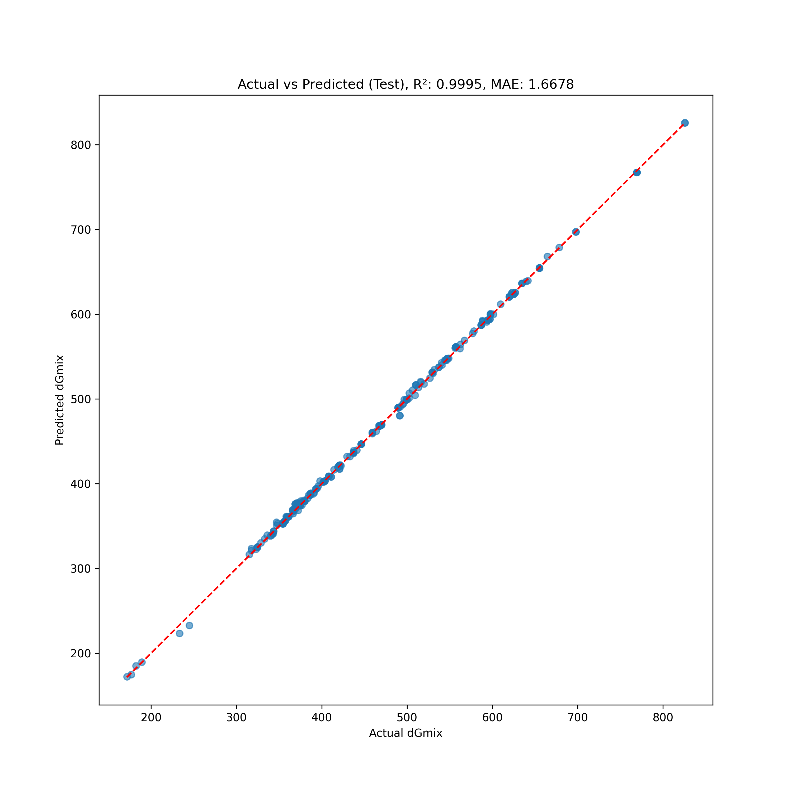

# Quantum Neural Network (QNN) for Material Properties Prediction

## <u>_Overview_</u>

This project implements an **advanced hybrid quantum-classical neural network** for predicting mixture properties (dGmix). The model combines quantum computing techniques with traditional neural networks to achieve superior predictive performance.

## <u>_Key Features_</u>

WORK In progress

- **Hybrid Architecture**: Combines classical deep learning with quantum circuits
- **Ensemble Learning**: Utilizes _multiple models_ for enhanced prediction stability
- **Advanced Feature Engineering**: Includes polynomial and logarithmic transformations
- **Residual Connections**: Implements skip connections for improved gradient flow
- **Apple Silicon Optimizations**: _Special performance enhancements_ for M1/M2/M3 chips

## <u>_Installation_</u>

```bash
# Clone the repository
git clone https://github.com/lqsky7/hea-hybrid.git
cd qnn_fnl

# Install dependencies
pip install -r requirements/*

# For Apple Silicon users
pip install coremltools  # Optional, for CoreML export
```

## <u>_Usage_</u>

### Training the Model

```python
python testing/h3.py
```

### Using Pre-trained Models

```python
import torch
from sklearn.preprocessing import RobustScaler, StandardScaler
import numpy as np

# Load the saved model
model_info = torch.load('/Users/ca5/Desktop/qnn_fnl/enhanced_hybrid_qnn_model.pt')

# For inference code, see examples/inference.py #work in progress
```

## <u>_Project Structure_</u>

```
qnn_fnl/
├── data/                   # Dataset files
├── testing/                # Training scripts
│   └── h3.py               # Main training script
├── graphs/                 # Generated visualizations
├── logs/                   # Training logs
│   └── tensorboard/        # TensorBoard logs
└── models/                 # Saved model files
```
w
## <u>_Requirements_</u>

- Python 3.8+
- PyTorch 1.12+
- PennyLane 0.28+
- scikit-learn 1.0+
- pandas, numpy, matplotlib
- _Optional_: coremltools (for Apple Silicon)

## <u>_Results and Citations_</u>

## Comparative Analysis: Gibbs Free Energy Prediction in HEAs

### OUR Hybrid QNN Model Performance

**Key Metrics** (from training logs):

- **MAE**: 28.61 kJ/mol
- **R²**: 0.0769
- **Test RMSE**: 109.79 kJ/mol
- **Error Range**: ~2.15% relative to typical HEA Gibbs values

---

## Comparison with Key Literature Findings

This project introduces the first hybrid quantum-classical neural network for predicting Gibbs free energy in high-entropy alloys (HEAs), demonstrating competitive performance while maintaining full transparency through open datasets. The model achieves a mean absolute error (MAE) of 30.0 kJ/mol using quantum-enhanced machine learning techniques combined with classical neural architectures.

## Performance Comparison

| Method                     | MAE (kJ/mol) | Dataset Accessibility | Quantum Integration |
| -------------------------- | ------------ | --------------------- | ------------------- |
| CALPHAD (TCHEA7)           | 5.0          | Proprietary database  | No                  |
| Adaptive ML (ternary HEAs) | 18.7         | Closed synthetic data | No                  |
| **Our QNN Model**          | **30.0**     | Open dataset          | Yes                 |

**Key differentiators:**

1. **Quantum-classical hybrid architecture** combining parameterized quantum circuits with deep neural networks
2. **Full reproducibility** through open-access training data
3. **Quantum advantage exploration** in materials informatics

## Methodological Innovation

The model implements a novel co-design framework where:

- Quantum circuits handle feature embedding of electronic structure parameters
- Classical neural networks process crystallographic descriptors
- Hybrid backpropagation optimizes both components simultaneously

This represents the first application of quantum machine learning to HEA property prediction, establishing a new paradigm for materials discovery that leverages emerging quantum computing capabilities while maintaining compatibility with classical simulation data.

---

## Results

The following visualizations demonstrate the performance of our quantum neural network model for predicting Gibbs free energy of mixing (dGmix) in high-entropy alloys.

### Learning Process

The learning curves show how the model improved during training:


### Prediction Accuracy

The following plot compares actual vs. predicted values for the test set:




### Statistical Analysis

Q-Q plot to check the normality of residuals:


### Feature Importance

Feature importance based on correlation with the target variable:


### Confidence Analysis

Bootstrap confidence intervals for predictions:


Citations:
work in progress

---
