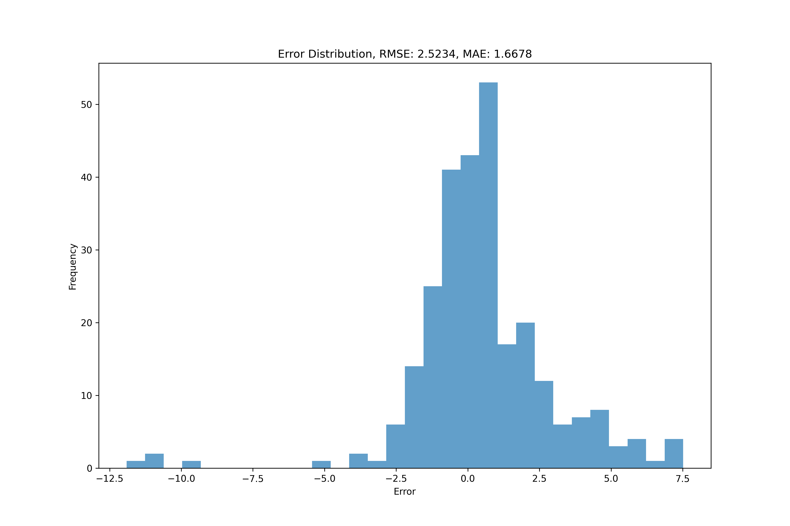
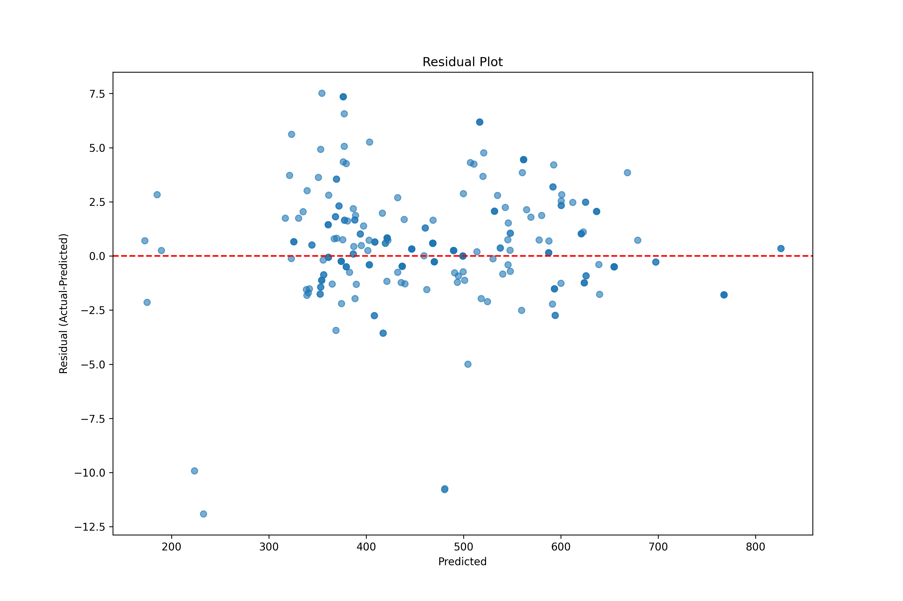

# Quantum Neural Networks for High Entropy Alloys

## Overview

This repository implements **Quantum Neural Networks (QNN)** for predicting **Gibbs free energy** of **High Entropy Alloys (HEAs)**. The project explores how quantum computing can enhance machine learning models for materials science applications, leveraging quantum circuits to create neural network architectures that may offer advantages in processing complex materials data and predicting thermodynamic properties.

## Features

- **Hybrid quantum-classical neural network** implementation
- Gibbs free energy (dGmix) prediction using quantum circuits
- Customizable quantum layer architectures
- Benchmarking tools to compare quantum vs. classical approaches
- Comprehensive visualization tools for model performance analysis

## Installation

### Prerequisites

**Only** Use Python 3.10 and follow requrements

### Setup

```bash
# Clone the repository
git clone https://github.com/lqsky7/qnn_fnl.git
cd qnn_fnl

# Create a virtual environment (recommended)
python3.10 -m venv venv
source venv/bin/activate  # On Windows: venv\Scripts\activate

# Install dependencies
pip install -r requirements/req-hyb.txt
```

## Model Results & Visualizations

Our quantum neural network demonstrates promising results in predicting the Gibbs free energy of High Entropy Alloys. Below are key visualizations of model performance:

### Learning Curves


_This graph shows the **training and validation loss** over epochs. The decreasing trend indicates the model is successfully learning the patterns in the HEA data, while the close tracking between training and validation curves suggests good generalization with minimal overfitting._

### Actual vs. Predicted (Test Set)


_This plot compares the **actual dGmix values** against the **model predictions** on the test set. The alignment along the diagonal red line indicates high prediction accuracy. The R² value measures how well our model explains the variance in the target variable._

### Error Distribution



_The histogram shows the **distribution of prediction errors** (actual minus predicted values). A distribution centered around zero with narrow spread indicates accurate predictions. The RMSE (Root Mean Squared Error) value quantifies the model's average prediction error._

### Residual Plot



_This plot shows **residuals** (prediction errors) against predicted values. An ideal model shows randomly distributed residuals around the zero line with no discernible pattern, indicating that the model has captured all systematic patterns in the data._

### 3D Surface Plot


_This **3D visualization** shows how the predicted dGmix varies with the two most influential features in the dataset. The surface curvature reveals complex, non-linear relationships between alloy composition parameters and Gibbs free energy that our quantum neural network has learned._

### Overview of All Plots


_A **composite view** of all visualization tools used to analyze model performance, enabling quick comparison across multiple evaluation metrics._

### Enhanced QNN Results


_A **comprehensive dashboard** showing model performance across multiple metrics, including training/validation loss, actual vs. predicted values, error distribution, and prediction trends._

## Dataset

This project utilizes a High Entropy Alloy dataset with the following key features:

- **Alloy compositions** (elemental percentages)
- **Physical properties** (density, melting temperature, etc.)
- **Thermodynamic parameters** (mixing enthalpy, mixing entropy)
- **Target variable**: Gibbs free energy of mixing (dGmix)

## Structure

- `/data`: Contains HEA datasets used for training and testing
- `/graphs`: Visualization outputs for model evaluation
- `/models`: Pre-trained models and model definition files
- `/training`: Training scripts for QNN implementation
  - `/training/circuits`: Quantum circuit definitions
- `/testing`: Testing and evaluation scripts
- `/notebooks`: Jupyter notebooks with examples and experiments

## Results


- **RMSE**: Measures the average prediction error magnitude
- **MAE**: Measures the average absolute prediction error
- **R²**: Indicates how well the model explains variance in the data

## Contributing

Contributions are welcome! Please feel free to submit a Pull Request. For major changes, please open an issue first to discuss what you would like to change.

1. Fork the repository
2. Create your feature branch (`git checkout -b feature/amazing-feature`)
3. Commit your changes (`git commit -m 'Add some amazing feature'`)
4. Push to the branch (`git push origin feature/amazing-feature`)
5. Open a Pull Request

## License

TBD

## Contact

Your Name - ca5lqsky7@gmail.com
Project Link: [https://github.com/lqsky7/TBD](https://github.com/yourusername/qnn_fnl)
