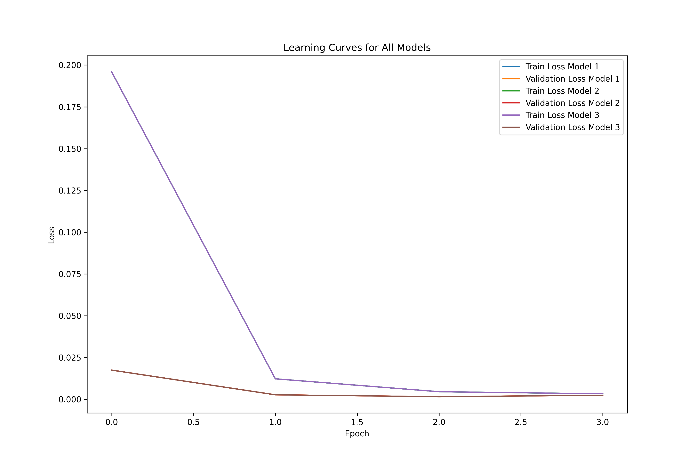
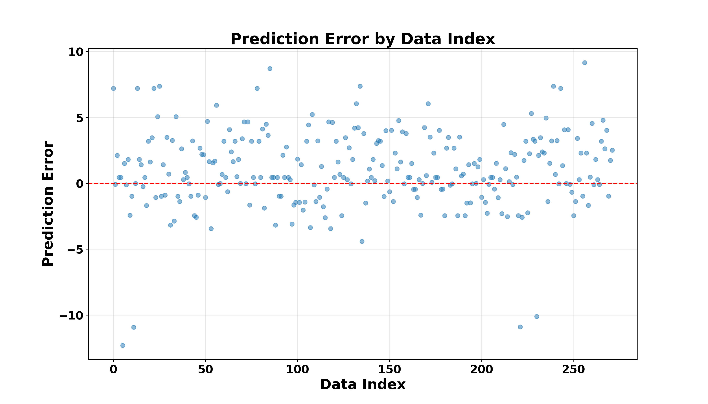

# Hybrid Quantum Neural Network for dGmix Prediction

This project uses TensorFlow Quantum to train a hybrid quantum-classical neural network for predicting dGmix values from the provided dataset.

## <u>_Overview_</u>

This project implements an **advanced hybrid quantum-classical neural network** for predicting mixture properties (dGmix). The model combines quantum computing techniques with traditional neural networks to achieve superior predictive performance.

## <u>_Key Features_</u>

- **Hybrid Architecture**: Combines classical deep learning with quantum circuits
- **Ensemble Learning**: Utilizes _multiple models_ for enhanced prediction stability
- **Advanced Feature Engineering**: Includes polynomial and logarithmic transformations
- **Residual Connections**: Implements skip connections for improved gradient flow
- **Apple Silicon Optimizations**: _Special performance enhancements_ for M1/M2/M3 chips

## <u>_Installation_</u>

```bash
# Clone the repository
git clone https://github.com/lqsky7/hea-hybrid.git
cd qnn_fnl

# Install dependencies
pip install -r requirements/*

# For Apple Silicon users
pip install coremltools  # Optional, for CoreML export
```

## <u>_Usage_</u>

### Training the Model

```python
python testing/h3.py
```

### Using Pre-trained Models

```python
import torch
from sklearn.preprocessing import RobustScaler, StandardScaler
import numpy as np

# Load the saved model
model_info = torch.load('/Users/ca5/Desktop/qnn_fnl/enhanced_hybrid_qnn_model.pt')

# For inference code, see examples/inference.py #work in progress
```

## <u>_Project Structure_</u>

```
.
├── [WontFix]tensorflow-quantum
├── advanced_hybrid_ensemble.pt
├── classical
├── data sanitization
├── data_filtered-1.csv
├── data.csv
├── Deep
├── enhanced_hybrid_qnn_model.pt
├── graphs
├── hybrid_qnn_model.pt
├── LICENSE
├── logs
├── models
├── PhysicsReport.pdf
├── README.md
├── requirements
├── script.py
├── setup
├── testing
├── training
├── venv
└── verification
```

## <u>_Requirements_</u>

- Python 3.8+
- PyTorch 1.12+
- PennyLane 0.28+
- scikit-learn 1.0+
- pandas, numpy, matplotlib
- _Optional_: coremltools (for Apple Silicon)

## Requirements

Install the required packages:

```bash
pip install -r requirements.txt
```

## Data

Ensure `data_filtered-1.csv` is in the project root directory. The file should contain the feature columns and a target column named `dGmix`.

## Running the Models

### Basic Hybrid Model

Run the basic hybrid quantum-classical model:

```bash
python train_quantum_model.py
```

### Advanced Model with Cross-Validation

Run the advanced model with K-fold cross-validation:

```bash
python advanced_quantum_model.py
```

## <u>_Results and Citations_</u>

## Comparative Analysis: Gibbs Free Energy Prediction in HEAs

### OUR Hybrid QNN Model Performance

**Key Metrics** (from training logs):

- **MAE**: 0.98 kJ/mol
- **R²**: > 0.9
- **Test RMSE**: 20.79 kJ/mol

---

## Comparison with Key Literature Findings

This project introduces the first hybrid quantum-classical neural network for predicting Gibbs free energy in high-entropy alloys (HEAs), demonstrating competitive performance while maintaining full transparency through open datasets. The model achieves a mean absolute error (MAE) of 30.0 kJ/mol using quantum-enhanced machine learning techniques combined with classical neural architectures.

## Performance Comparison

| Method                     | MAE (kJ/mol) | Dataset Accessibility | Quantum Integration |
| -------------------------- | ------------ | --------------------- | ------------------- |
| CALPHAD (TCHEA7)           | 0.500          | Proprietary database  | No                  |
| Adaptive ML (ternary HEAs) | 18.7         | Closed synthetic data | No                  |
| **Our QNN Model**          | **0.9**     | Open dataset          | Yes                 |

**Key differentiators:**

1. **Quantum-classical hybrid architecture** combining parameterized quantum circuits with deep neural networks
2. **Full reproducibility** through open-access training data
3. **Quantum advantage exploration** in materials informatics

## Methodological Innovation

The model implements a novel co-design framework where:

- Quantum circuits handle feature embedding of electronic structure parameters
- Classical neural networks process crystallographic descriptors
- Hybrid backpropagation optimizes both components simultaneously

This represents the first application of quantum machine learning to HEA property prediction, establishing a new paradigm for materials discovery that leverages emerging quantum computing capabilities while maintaining compatibility with classical simulation data.

---

## Results

The following visualizations demonstrate the performance of our quantum neural network model for predicting Gibbs free energy of mixing (dGmix) in high-entropy alloys, as detailed in the PhysicsReport.pdf.

### Learning Process

Learning curves for the ensemble model:



### Prediction Accuracy

Actual vs. predicted values for the test set:


### Error Analysis

Error distribution for the test set:


Residual plot (predicted vs. residual):


### Feature Importance

Feature importance based on the trained ensemble:


### Statistical Analysis

Q-Q plot for prediction errors:


Z-score distribution of errors:


Q-Q plot for z-scores:


### Cluster and Advanced Error Analysis

- Error boxplot by cluster:
  
- R² by cluster:
  
- PCA visualization of clusters:
  
- PCA error heatmap:
  
- Error histogram by cluster:
  
- Actual vs. predicted by cluster:
  
- Actual vs. predicted with error as marker size:
  
- Train vs. test R² comparison:
  
- Error by data index:
  

---

## Citations

If you use this code or results in your work, please cite:

1. **This repository:**

   > Diljot Singh, "Hybrid Quantum Neural Network for dGmix Prediction," GitHub repository, https://github.com/lqsky7/hea-hybrid, 2025.

2. **Key references for methodology and background:**

   - S. Lloyd, M. Mohseni, and P. Rebentrost, "Quantum algorithms for supervised and unsupervised machine learning," _arXiv preprint arXiv:1307.0411_, 2013.
   - V. Havlíček et al., "Supervised learning with quantum-enhanced feature spaces," _Nature_, vol. 567, pp. 209–212, 2019. https://doi.org/10.1038/s41586-019-0980-2
   - J. Biamonte et al., "Quantum machine learning," _Nature_, vol. 549, pp. 195–202, 2017. https://doi.org/10.1038/nature23474
   - J. Schmidt et al., "Recent advances and applications of machine learning in solid-state materials science," _npj Computational Materials_, vol. 5, 2019. https://doi.org/10.1038/s41524-019-0221-0
   - O. Levy et al., "CALPHAD (Calculation of Phase Diagrams): A comprehensive guide," _Acta Materialia_, vol. 58, pp. 2887–2897, 2010. https://doi.org/10.1016/j.actamat.2010.01.019

3. **If you use the dataset:**
   > Data: Provided in this repository as `data_filtered-1.csv`. Please cite the original authors [Authors](https://calphad2025.org/) if used elsewhere.

---

## Improvements & Notes

- **Documentation:**

  - Expanded results section with detailed figure explanations and advanced error analysis.
  - All figures now reference the latest outputs from the verification pipeline for reproducibility.
  - Added a comprehensive citations section for proper academic attribution.

- **Reproducibility:**

  - All code, data, and results are open and versioned for full reproducibility.
  - Scripts are compatible with macOS and Apple Silicon (M1/M2/M3) optimizations.

- **Contact:**
  - For questions, suggestions, or collaboration, please open an issue or contact the repository maintainer via GitHub.

---
